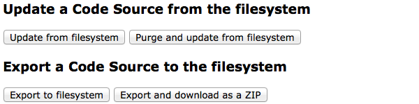

Code Sources on the file system
===============================

This document explains how to deal with Code Sources on the file
system level. Code Sources are usually first created in the
:term:`ZMI` and then dumped to the file system. This allows their code
to be checked into a source code control system and simplifies future
maintenance of Code Sources within Silva sites.

A Manager role is needed to create a Code Source in the
:term:`ZMI`. This process is explained in the user documentation:
http://silvacms.org/docs/user/manager/creating_a_code_source

Sometimes a newly created Code Source is a one-off, meaning it won't
be used elsewhere. However if the Code Source needs to be maintained
and/or used in multiple sites then it makes sense to manage the Code
Source via Silva's Code Source Service. FMI see:
http://silvacms.org/docs/user/manager/code_source_service

A Silva developer can create a product that will contain all the Code
Sources used in various sites. These sources will then be available in
the Code Source Service.

.. contents::

.. _silva_api_for_code_sources:

Silva API for Code Sources
--------------------------

Since Code Sources are executed from scripts and templates defined in
ZODB content, even if the original file used to create those comes
from the filesystem, they are restricted in the API they can use.

In order to improve the possiblities they can provide, a simple API
let them access the core features of Silva in a secure way:

.. module:: Products.SilvaExternalSources.codesources.api

.. function:: render_content(content, request, suppress_title=False)

   Renders the given ``content`` using the ``request``. If
   ``suppress_title`` is true, the title won't be rendered, if it is
   possible (not every content in Silva support this option).

   :returns: A string containing the rendered HTML.

.. function:: include_resource(css=None, js=None, requires=[], bottom=False)

   Include the specified ``css`` or ``js`` URL in the final rendered
   page. They can be either a string, representing the URL, or a list
   of string representing multiple URLs if multiple resources must be
   included at once. ``requires`` let you specify a list of resources
   previously included that must appear before the one you are
   currently included. If ``bottom`` is true, the resources will be
   rendered if possible at the bottom of the page.

   :returns: A resource object that can be passed again to an resource
      include function in the ``requires`` argument.

.. function:: include_snippet(css=None, js=None, requires=[], bottom=False)

   Include the specified ``css`` or ``js`` snippet in the final
   rendered page. This behaves exactly like the
   :py:func:`include_resources` function, except it uses snippets
   instead of URLs.

.. function:: get_publishable_content_types(context)

   Return all available Zope *meta_type* of Silva content that be
   pusblished in the site. ``context`` must be a Zope object stored
   inside the Silva site, only used to retrieve the Silva site.

   :returns: A list containing the content *meta_types*.

.. function:: get_container_content_types(context)

   Return all available *meta_type* of Silva content that be added in
   the site (publishable and not publishable). ``context`` must be a
   Zope object stored inside the Silva site, only used to retrieve the
   Silva site.

.. function:: get_content_tree(content, depth)

   Return the content tree starting from the given ``content`` with at
   most the given ``depth``. This will return the result of the
   ``get_tree`` provided by the :term:`Zope adapter`
   :py:interface:`~silva.core.interfaces.adapters.ITreeContents`

   .. warning:: This might be slow and trigger performances issues.

.. function:: get_content_public_tree(content, depth)

   Return the public content tree starting from the given ``content``
   with at most the given ``depth``. This will return the result of
   the ``get_public_tree`` provided by the :term:`Zope adapter`
   :py:interface:`~silva.core.interfaces.adapters.ITreeContents`

   .. warning:: This might be slow and trigger performances issues.

Silva extensions might provide additional API to let Code Sources
access theirs features.

Using the Silva API in a Code Source
~~~~~~~~~~~~~~~~~~~~~~~~~~~~~~~~~~~~

You can easily those defined function in your code source. To use them
from a ZODB script, just import them:

.. code-block:: python

   from Products.SilvaExternalSources.codesources.api import render_content

From a page template, you can use a ``python`` expression in order to
access them:

.. code-block:: html

   <tal:content
       tal:define="render_content python:modules['Products.SilvaExternalSources.codesources.api'].render_content"
       tal:content="python:render_content(document, request)" />

Exporting and creating a Code Source on the filesystem
------------------------------------------------------

You can define Code Sources on the file system, inside a Python
package. By declaring this package in the ``setup.py`` file, the
``service_codesources`` in :term:`ZMI` will be able to propose to
managers to install those Code Sources.

.. _preparing-a-silva-extension-to-hold-code-sources:

Preparing a Silva extension to hold Code Sources
~~~~~~~~~~~~~~~~~~~~~~~~~~~~~~~~~~~~~~~~~~~~~~~~

To be able to create and export code sources inside a Silva extension,
you need to declare a sub-Python package (basically a folder) to hold
them. For instance in case of the ``silva.app.blog`` extension you
need to:

- create a sub-package, with an empty ``__init__.py`` like
  ``silva.app.blog.codesources``,

- add the following parameters to the call to the function ``setup``
  in the ``setup.py`` file of your extension:

  .. code-block:: python

     entry_points="""
     [Products.SilvaExternalSources.sources]
     defaults = silva.app.blog.codesources
     """,

After this modification you need to re-run buildout for the
modification in the ``setup.py`` file and restart your Silva
server:

.. code-block:: sh

   $ cd Silva
   $ bin/buildout -v
   $ bin/paster serve debug.ini restart

Now your package is properly configured to hold Code Sources.

Exporting a new Code Source previously created in the ZMI
~~~~~~~~~~~~~~~~~~~~~~~~~~~~~~~~~~~~~~~~~~~~~~~~~~~~~~~~~

Once a Code Source is created and tested in the ZMI, its code can be
dumped to the file system.  To export a new Code Source in a
configured extension, you need first to create a directory that has
the same name as your Code Source inside the previously created
``codesources`` folder in the Python package that is configured to
host the Code Sources.  In this new directory you need to create an
empty file called ``source.ini``.

For instance, in the case of the ``silva.app.blog`` extension you can
create a directory called ``cs_feedback`` to export a Code Source
called ``cs_feedback`` in it. You should now have the following
directories and files in your extension::

  src/silva/app/blog/codesources
  src/silva/app/blog/codesources/__init__.py
  src/silva/app/blog/codesources/cs_feedback
  src/silva/app/blog/codesources/cs_feedback/source.ini

Afterwards you can either restart your Silva server or click on the button
*Refresh* located on the tab *Install Code Sources* of the
``service_codesources`` in the :term:`ZMI`. Your Code Source,
``cs_feedback`` should now appear in the list of installable Code
Sources and be marked as broken.

If you now visit in the :term:`ZMI` the edit tab of your Code Source,
you should be able to select next to the *Location* option the value
``silva.app.blog:/silva/app/blog/codesources/cs_feedback`` and click
on the button *Save changes*. After this you should see four new
buttons (see the figure below), among these buttons there's *Export to
filesystem* button.  Clicking on this button should export the files
of your Code Source on the filesystem in the newly created directory.

Update and Export buttons in the ZMI

If you're working on a remote server then the *Export and download as
ZIP* function may be useful. This will export Code Source files packed
in a ZIP file.  After clicking on it, save the ZIP to your disk and
expand it.

Depending on the Code Source contents, there will be three or more
files. As an example, exporting the TOC Code Source as zip will give
an archive that will contain::

  icon.png  parameters.xml  source.ini  toc.pt  toc_sort_on.py

* The icon which is used in the :term:`SMI`.

* The parameters XML file which contains the parameters form.

* The ``source.ini`` contains configuration, the same as in the Edit
  screen form.

* The ``toc.pt`` is the renderer, which can be a page template or Python script.

* A helper script, ``toc_sort_on.py``, is also present.

The directory containing these items can be moved into the
'codesources' directory of your product. It makes sense to give the
directory the same name as the id in the ``source.ini``.

If you give the name a prefix this will cause the sources to be
grouped together in the ZMI, e.g. Silva's default Code Sources all
have an id that is prefixed with ``cs_``.

Creating a new Code Source directly on the filesystem
~~~~~~~~~~~~~~~~~~~~~~~~~~~~~~~~~~~~~~~~~~~~~~~~~~~~~

To create a Code Source on the file system you need a few files.  The
most important one is ``source.ini``. This file follows a windows like
INI file format to define the properties and settings of the Code
Source.

.. code-block:: buildout
   :linenos:

   [source]
   id = cs_feedback
   title = Blog article feedback
   render_id = render_feedback
   description = Display the feedback that was posted on the
      article of a blog.
   usuable = on
   previewable = on

- Line 1 defines a configuration section to store the Code Source
  parameters,

- Line 2 defines the default identifier that will be used to create
  the Code Source during the installation. The identifier is used as
  well to associate the Code Source on the filesystem with an instance
  in the ZODB,

- Line 3 defines the title that the Silva user will see and use in
  order to select the Code Source in Silva content,

- Line 4 defines the name of the script or page template that will be
  used in order to render the Code Source in Silva content,

- Line 5 to 6 define an optional description that the Silva user will
  see in addition to the title,

- Line 7 sets the flag ``usuable`` to on. This flag will allow the
  Silva user to use this Code Source and create newly set of
  parameters in Silva content. If set to off only existing set
  parameters can be edited in Silva content,

- Line 8 sets the flag ``previewable`` to on, that will enable to
  preview Code Sources in the WYSIWYG editor. Preview in the
  editor can be disabled, in cases the Code Source
  contains complicated Javascript that might not work in the editor.

If your Code Source needs parameters, you can add a file called
``parameters.xml`` that contains the XML definition of a Formulator
form.

You can add an icon to your Code Source, by adding a file called
``icon.png`` or ``icon.gif`` to your Code Source.

Any other file you add in the Code Source will be installed inside it.

For instance in the case of the ``silva.app.blog`` extension, you
should have the following files in the code source at the end::

  src/silva/app/blog/codesources
  src/silva/app/blog/codesources/__init__.py
  src/silva/app/blog/codesources/cs_feedback
  src/silva/app/blog/codesources/cs_feedback/source.ini
  src/silva/app/blog/codesources/cs_feedback/icon.png
  src/silva/app/blog/codesources/cs_feedback/parameters.xml
  src/silva/app/blog/codesources/cs_feedback/render_feedback.pt

Export of multiple Code Sources at once
~~~~~~~~~~~~~~~~~~~~~~~~~~~~~~~~~~~~~~~

It is possible to export multiple code sources located inside the same
folder, directly below it or located in sub-folders at once.

For this you need first to
:ref:`preparing-a-silva-extension-to-hold-code-sources`. After, you
can in :term:`ZMI` access the form ``/manage_export_codesources`` on
the folder URL that contains the Code sources you want to export. You
need to fill the name of your extension in the *Extension name* field,
check *Recursive export?* if you want to export Code Sources located
in sub-folder and click on the *Export* button. Found Code Sources
will be created inside the extension. If a Code Sources with the same
identifier already exists inside the extension, it will be updated
only if the Code Source location matches the extension one.
