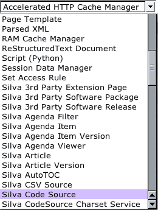
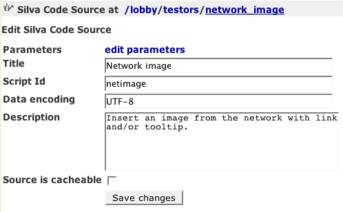
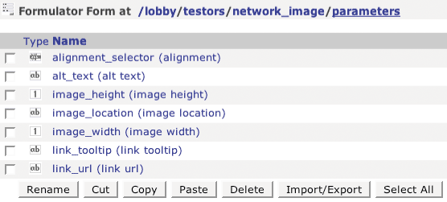
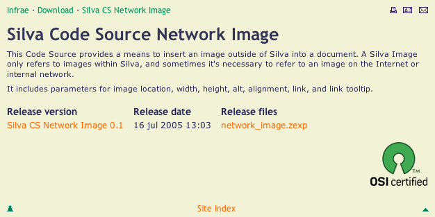

Maintaining Code Sources
========================

This document explains how to deal with Code Sources on the file system level.
Code Sources are usually first created in the ZMI and then dumped to the file
system. This allows their code to be checked into a source code control system
and simplifies future maintenance of Code Sources within a Silva instance.

A Manager role is needed to create a Code Source in the ZMI. This process is
explained in the user documentation:
http://silvacms.org/documentation/user-documentation/manager

Sometimes a newly created Code Source is a one-off, meaning it won't be used
elsewhere. However if the Code Source needs to be maintained and/or used in
multiple sites then it makes sense to manage the Code Source via Silva's
Code Source Service. See:
http://silvacms.org/documentation/user-documentation/manager/code_source_service

In order to do this the code must be migrated from the
ZMI to the file system.

A Silva developer can create a product that will contain all the Code Sources
used in a site.

Migrating a Code Source to the file system
------------------------------------------

Once a Code Source in the ZMI is created and tested, its code can be dumped to
the file system. In the Edit screen of a Code Sourse there is a "Dump to file
system" button (XXX not yet, but it's on the way).
This will export the code as a ZIP file. Save the file to your
local disk and expand it.

Depending on the Code Source contents, there will be three or more files. As an
example we'll dump the TOC Code Source which will contain:

icon.png  parameters.xml  source.ini  toc.pt  toc_sort_on.py

* The icon which is used in the SMI.

* The paraemters XML file which contains the parameters form

* The source.ini contains configuration, the same as in the Edit screen form.

* The toc.pt is the renderer, which can be a page template or Python script

* A helper script, toc_sort_on.py, is also present.

The folder containing these items should be moved into the 'codesources'
directory of your product. It makes sense to give the folder the same name
as the id in the source.ini. If you prefix the name that will group all your
Code Sources together in the ZMI, e.g. Silva's default Code Sources all have
an id that starts with 'cs_'.

XXX Then you must do some Python configuration in your product....

Creating a code source
======================

Code Sources can provide practically any functionality possible in
Zope, yet keep an Author safely in the Silva management area. By
creating parameters for the Code Source, site managers can give
Authors the possibility to create local variants, and since the
parameters form shows up as a Kupu toolbox, all editing occurs in one
screen (and is stored in one document). This helps retain that
difficult balance between freedom to ‘create’ and too much leeway.

As an example we’ll make a Code Source to include an image outside of
Silva into a document. A Silva Image only refers to images within
Silva, and sometimes it’s necessary to refer to an image on the
Internet or internal network. For instance OSI, the Open Source
Initiative, makes a logo available that indicates that software has a
certified open source license. They specifically request that you not
put the image on your own site, but link to the logo on their site:

We insist and ask that you link to the images of your choice instead
of saving it on your own server.

OSI

http://opensource.org/trademarks/

Creating a Code Source
----------------------

The first step is to go to the location in the ZMI where you need the
Code Source. This should probably be the Silva root – so it can be
found from anywhere in the site – but could nested be in a branch.

Select Silva Code Source.

Configuration
,,,,,,,,,,,,,

Fill in an id, title, and script id.

For this example we named the Code Source ‘network_image’ and gave the
script the id ‘netimage’. The data encoding is set as UTF-8 in case we
want to add a caption, and a description of the Code Source is filled
in. For now we won’t make the source cachable, but when finished it’s
a good idea to do so, because there’s nothing dynamic in the Code
Source and having it cached provides a big performance boost.

Creating parameters
-------------------

The Author will need to fill in various parameters, and we’ll create a
form to hold these values.

**Click** edit parameters.

**Add** and **configure** form fields.

**Click** the order tab and **arrange** the fields in a sensible order.

The form is a `Formulator <http://infrae.com/products/formulator>`_
form. Using Formulator is fairly intuitive, but there is a `HowTo
<http://www.zope.org/Members/faassen/Formulator/formulator_howto>`_
available on zope.org if needed. Some of the fields should have their
required checkbox turned off, and you may want to enter a css class to
style the controls. In this example the finished field listing looks
like this:

Following are descriptions of the fields, listed in the order in which
they appear in a rendered form.

  * alignment: sets the standard Silva image alignments (default,
    align left, align center, align right, float left, float right).

  * image location: this field is required.

  * image width: an integer field. Formulator will complain in an
    alert if anything besides an integer is entered.

  * image height: these dimension fields are required, as they
    considerably speed up page display in the browser.

  * alt text: sets the alt text for the image. This field has a
    default value filled in – ‘image content’ – to coax the Author to
    fill in a text for the image alt attribute.

  * link url: optional destination of the image’s link.

  * link tooltip: if the image is linked, the text in this field will
    appear in a tooltip when a visitor rolls over the image with the
    cursor.

Note that the link url is a string field, and while it’s required,
there is no validation. A validator could be written to ensure that an
http link is properly formatted, scrub scripting, check that the
target file has a specific extension, etc.

Code Source toolbox
,,,,,,,,,,,,,,,,,,,

.. image:: codesourcetoolbox.png

Creating the script or page template
------------------------------------

Once the form is finished, **click** on the id of the Code Source in the
breadcrumb trail, ‘network_image’. This brings you back to the
configuration screen.

**Click** on the Contents tab.

**Add** a page template with the id ‘netimage’.

The code of the page template is:

.. code-block:: html

  <tal:block define="
    alignment  options/alignment_selector | nothing;
    centered   python:alignment == 'image-center' and alignment or nothing;
    location   options/image_location | nothing;
    linkurl    options/link_url | nothing;">
    <!-- network image -->
    

      
    

  </tal:block>

TAL analysis
------------

The rendering code is nested in a ``tal:block`` element that defines
some variables. These variables are used multiple times in the
template, so it’s more efficient to define them once in the
beginning. For instance the ``linkurl`` variable is used twice, once
to check if there **is** a link url, and then to set it.

The ``alignment`` variable sets the css class of the image.

The second define, ``centered``, is there because we need to put a div
around an image to make it center. The other alignments are all
defined on the image itself.

The ``location`` variable is used in a condition in the ``img`` tag to
check if a location exists in the request (in options). The field is
required, so we’re reasonably sure it will exist, but the condition
assures a visitor won’t get an error page if it’s not there.

The ``div`` has a ``tal:omit-tag`` attribute that checks if the image
should be centered. If its alignment is anything other than centered
then the ‘variable == nothing’ and the ``div`` tag is omitted.

The same thing happens with the image link: if there isn’t an image
link, the tag is omitted, otherwise there would be an empty ``href``
in the rendered html.

Rendering
,,,,,,,,,

The rendered html output of the Code Source exactly matches Silva
html, so all layout and existing css styles should work the same as
with a Silva Image. The page template elements are not indented to
avoid excess spaces in the html.

Working
-------

The OSI certified logo is a network image.

Download the Code Source
------------------------

You can `download <http://www.infrae.com/products/silva/codesources/networkimage_cs>`_
a zexp of the Network Image CS.

Developer caveat
,,,,,,,,,,,,,,,,

The parameters of a Code Source are stored as XML in a Silva
document. When the document is later viewed, the stored value is
retrieved from the XML, but all values are strings. If your Code
Source has a Python script that expects an integer (because you
created an integer field as we did in this example) but it gets a
string, strange things can happen, including excessive recursion.

This problem must be solved in your code. You can use an integer
field, but in your script you'll have to cast from string to integer
before doing anything with the variable. The developer does have the
assurance that the string (s)he gets back can be safely cast to an
integer, since the validation ensures that.
